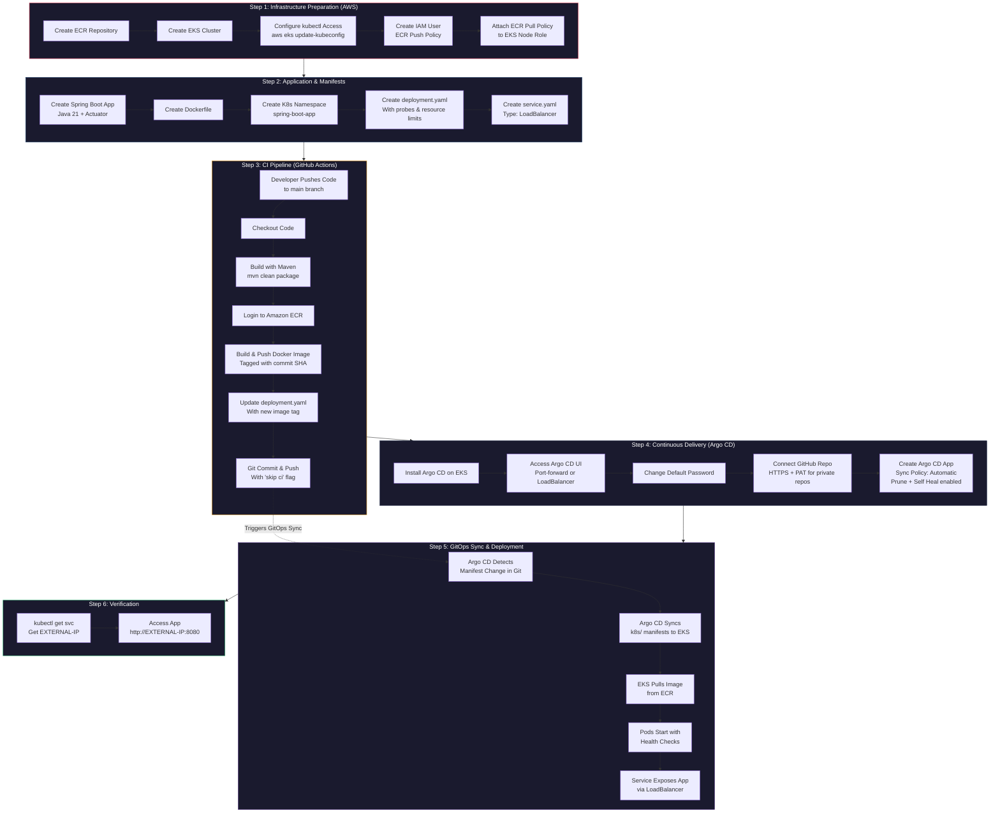

# GitOps Deployment Process Flow

```mermaid
flowchart TD
    subgraph STEP1["Step 1: Infrastructure Preparation (AWS)"]
        A1[Create ECR Repository] --> A2[Create EKS Cluster]
        A2 --> A3[Configure kubectl Access\naws eks update-kubeconfig]
        A3 --> A4[Create IAM User\nECR Push Policy]
        A4 --> A5[Attach ECR Pull Policy\nto EKS Node Role]
    end

    subgraph STEP2["Step 2: Application & Manifests"]
        B1[Create Spring Boot App\nJava 21 + Actuator] --> B2[Create Dockerfile]
        B2 --> B3[Create K8s Namespace\nspring-boot-app]
        B3 --> B4[Create deployment.yaml\nWith probes & resource limits]
        B4 --> B5[Create service.yaml\nType: LoadBalancer]
    end

    subgraph STEP3["Step 3: CI Pipeline (GitHub Actions)"]
        C1[Developer Pushes Code\nto main branch] --> C2[Checkout Code]
        C2 --> C3[Build with Maven\nmvn clean package]
        C3 --> C4[Login to Amazon ECR]
        C4 --> C5[Build & Push Docker Image\nTagged with commit SHA]
        C5 --> C6[Update deployment.yaml\nWith new image tag]
        C6 --> C7[Git Commit & Push\nWith 'skip ci' flag]
    end

    subgraph STEP4["Step 4: Continuous Delivery (Argo CD)"]
        D1[Install Argo CD on EKS] --> D2[Access Argo CD UI\nPort-forward or LoadBalancer]
        D2 --> D3[Change Default Password]
        D3 --> D4[Connect GitHub Repo\nHTTPS + PAT for private repos]
        D4 --> D5[Create Argo CD App\nSync Policy: Automatic\nPrune + Self Heal enabled]
    end

    subgraph STEP5["Step 5: GitOps Sync & Deployment"]
        E1[Argo CD Detects\nManifest Change in Git] --> E2[Argo CD Syncs\nk8s/ manifests to EKS]
        E2 --> E3[EKS Pulls Image\nfrom ECR]
        E3 --> E4[Pods Start with\nHealth Checks]
        E4 --> E5[Service Exposes App\nvia LoadBalancer]
    end

    subgraph STEP6["Step 6: Verification"]
        F1[kubectl get svc\nGet EXTERNAL-IP] --> F2[Access App\nhttp://EXTERNAL-IP:8080]
    end

    STEP1 --> STEP2
    STEP2 --> STEP3
    STEP3 --> STEP4
    STEP4 --> STEP5
    STEP5 --> STEP6

    %% GitOps Loop
    C7 -.->|"Triggers GitOps Sync"| E1

    style STEP1 fill:#1a1a2e,stroke:#e94560,color:#fff
    style STEP2 fill:#1a1a2e,stroke:#0f3460,color:#fff
    style STEP3 fill:#1a1a2e,stroke:#f5a623,color:#fff
    style STEP4 fill:#1a1a2e,stroke:#16213e,color:#fff
    style STEP5 fill:#1a1a2e,stroke:#533483,color:#fff
    style STEP6 fill:#1a1a2e,stroke:#2eb872,color:#fff
```